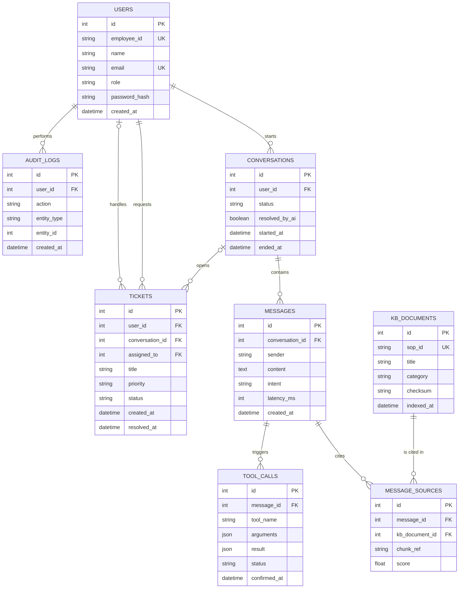

# Database Schema

```mermaid
erDiagram
  USERS ||--o{ CONVERSATIONS : starts
  USERS ||--o{ TICKETS : requests
  USERS |o--o{ TICKETS : handles
  USERS ||--o{ AUDIT_LOGS : performs
  CONVERSATIONS ||--o{ MESSAGES : contains
  CONVERSATIONS |o--o{ TICKETS : opens
  MESSAGES ||--o{ MESSAGE_SOURCES : cites
  MESSAGES ||--o{ TOOL_CALLS : triggers
  KB_DOCUMENTS ||--o{ MESSAGE_SOURCES : "is cited in"
  USERS {
    int id PK
    string employee_id UK
    string name
    string email UK
    string role
    string password_hash
    datetime created_at
  }
  CONVERSATIONS {
    int id PK
    int user_id FK
    string status
    boolean resolved_by_ai
    datetime started_at
    datetime ended_at
  }
  MESSAGES {
    int id PK
    int conversation_id FK
    string sender
    text content
    string intent
    int latency_ms
    datetime created_at
  }
  MESSAGE_SOURCES {
    int id PK
    int message_id FK
    int kb_document_id FK
    string chunk_ref
    float score
  }
  KB_DOCUMENTS {
    int id PK
    string sop_id UK
    string title
    string category
    string checksum
    datetime indexed_at
  }
  TOOL_CALLS {
    int id PK
    int message_id FK
    string tool_name
    json arguments
    json result
    string status
    datetime confirmed_at
  }
  TICKETS {
    int id PK
    int user_id FK
    int conversation_id FK
    int assigned_to FK
    string title
    string priority
    string status
    datetime created_at
    datetime resolved_at
  }
  AUDIT_LOGS {
    int id PK
    int user_id FK
    string action
    string entity_type
    int entity_id
    datetime created_at
  }
```